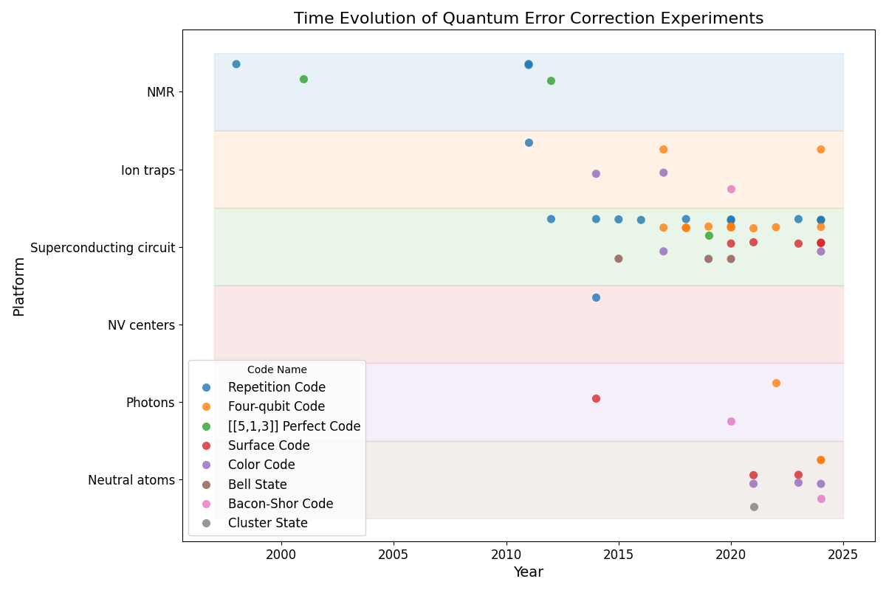

# Awesome Quantum Computing Experiments

A curated list of notable quantum computing experiments, focused primarily on the implementation of quantum error correction codes.

## Table of Contents

- [Quantum Error Correction](#quantum-error-correction)
	- [Repetition Code](#repetition-code)
	- [[[5,1,3]] Perfect Code](#513-perfect-code)
	- [Surface Code](#surface-code)
	- [Color Code](#color-code)
	- [Bell State](#bell-state)
	- [Four-qubit Code](#four-qubit-code)
	- [Bacon-Shor Code](#bacon-shor-code)
	- [Cluster State](#cluster-state)

## Quantum Error Correction

### Repetition Code

- [Experimental Quantum Error Correction](https://arxiv.org/abs/quant-ph/9802018) (1998) - [3,1,3] on NMR
- [Experimental Repetitive Quantum Error Correction](https://jubarreiro.physics.ucsd.edu/files/Schindler-Science-332-1059-1061.pdf) (2011) - [3,1,3] on Ion trap
- [Demonstration of Sufficient Control for Two Rounds of Quantum Error Correction in a Solid-State Ensemble Quantum Information Processor](https://arxiv.org/abs/1108.4842) (2011) - [3,1,3] on NMR
- [Experimental quantum error correction with high fidelity](https://arxiv.org/abs/1109.4821) (2011) - [3,1,3] on NMR
- [Realization of Three-Qubit Quantum Error Correction with Superconducting Circuits](https://arxiv.org/abs/1109.4948) (2012) - [3,1,3] on Superconducting circuit
- [Quantum error correction in a solid-state hybrid spin register](https://arxiv.org/abs/1309.6424) (2014) - [[3,1,3]] on NV centers
- [State preservation by repetitive error detection in a superconducting quantum circuit](https://arxiv.org/abs/1411.7403) (2014) - [3,1,3]-[5,1,5] on Superconducting circuit
- [Detecting bit-flip errors in a logical qubit using stabilizer measurements](https://arxiv.org/abs/1411.5542) (2015) - [3,1,3] on Superconducting circuit
- [Repeated quantum error correction on a continuously encoded qubit by real-time feedback](https://arxiv.org/abs/1508.01388) (2016) - [3,1,3] on Superconducting circuit
- [A repetition code of 15 qubits](https://arxiv.org/abs/1709.00990) (2018) - [3,1,3]-[8,1,8] on Superconducting circuit
- [Benchmarking near-term devices with quantum error correction](https://arxiv.org/abs/2004.11037) (2020) - [3,1,3]-[22,1,22] on Superconducting circuit
- [Exponential suppression of bit or phase flip errors with repetitive error correction](https://arxiv.org/abs/2102.06132) (2020) - [3,1,3]-[11,1,11] on Superconducting circuit
- [Suppressing quantum errors by scaling a surface code logical qubit](https://arxiv.org/abs/2207.06431) (2023) - [3,1,3]-[25,1,25] on Superconducting circuit, Repetition codes below threshold
- [Quantum error correction below the surface code threshold](https://arxiv.org/abs/2408.13687v1) (2024) - [3,1,3]-[29,1,29] on Superconducting circuit, Repetition codes below threshold
- [Hardware-efficient quantum error correction using concatenated bosonic qubits](https://arxiv.org/abs/2409.13025) (2024) - [[3,1,3]], [[5,1,5]] on Superconducting circuit, Repetition cat codes below threshold

### [[5,1,3]] Perfect Code

- [Benchmarking Quantum Computers: The Five-Qubit Error Correcting Code](https://arxiv.org/abs/quant-ph/0101034) (2001) - [[5,1,3]] on NMR
- [Experimental implementation of encoded logical qubit operations in a perfect quantum error correcting code](https://arxiv.org/abs/1208.4797) (2012) - [[5,1,3]] on NMR
- [Experimental exploration of five-qubit quantum error correcting code with superconducting qubits](https://arxiv.org/abs/1907.04507) (2019) - [[5,1,3]] on Superconducting circuit

### Surface Code

- [Experimental demonstration of a graph state quantum error-correction code](https://arxiv.org/abs/1404.5498v1) (2014) - [[4,1,2]] on Photons
- [Repeated Quantum Error Detection in a Surface Code](https://arxiv.org/abs/1912.09410) (2020) - [[4,1,2]] on Superconducting circuit
- [Realizing repeated quantum error correction in a distance-three surface code](https://arxiv.org/abs/2112.03708) (2021) - [[9,1,3]] on Superconducting circuit
- [A quantum processor based on coherent transport of entangled atom arrays](https://arxiv.org/abs/2112.03923) (2021) - [[13,1,3]] surface code, [[16,2,2]] toric code on Neutral atoms
- [Logical quantum processor based on reconfigurable atom arrays](https://arxiv.org/abs/2312.03982) (2023) - [[9,1,3]], [[25,1,5]], [[49,1,7]] on Neutral atoms
- [Suppressing quantum errors by scaling a surface code logical qubit](https://arxiv.org/abs/2207.06431) (2023) - [[9,1,3]]-[[25,1,5]] on Superconducting circuit, Repetition codes below threshold
- [Quantum error correction below the surface code threshold](https://arxiv.org/abs/2408.13687v1) (2024) - [[9,1,3]], [[25,1,5]], [[49,1,7]] on Superconducting circuit, Surface codes below threshold

### Color Code

- [Experimental Quantum Computations on a Topologically Encoded Qubit](https://arxiv.org/abs/1403.5426) (2014) - [[7,1,3]] on Ion traps
- [Fault-tolerant quantum error detection](https://arxiv.org/abs/1611.06946) (2017) - [[4,2,2]] on Ion traps
- [Experimental demonstration of fault-tolerant state preparation with superconducting qubits](https://arxiv.org/abs/1705.09259v1) (2017) - [[4,2,2]] on Superconducting circuit
- [A quantum processor based on coherent transport of entangled atom arrays](https://arxiv.org/abs/2112.03923) (2021) - [[7,1,3]] on Neutral atoms
- [Logical quantum processor based on reconfigurable atom arrays](https://arxiv.org/abs/2312.03982) (2023) - [[7,1,3]], [[8,3,2]] on Neutral atoms
- [Experimental Demonstration of Logical Magic State Distillation](https://arxiv.org/abs/2412.15165) (2024) - [[7, 1, 3]], [[17,1,5]] on Neutral atoms

### Bell State

- [Demonstration of a quantum error detection code using a square lattice of four superconducting qubits](https://www.nature.com/articles/ncomms7979) (2015) - [[2,0,2]] on Superconducting circuit
- [Entanglement stabilization using ancilla-based parity detection and real-time feedback in superconducting circuits](https://www.nature.com/articles/s41534-019-0185-4) (2019) - [[2,0,2]] on Superconducting circuit
- [Protecting quantum entanglement from leakage and qubit errors via repetitive parity measurements](https://arxiv.org/abs/1905.12731) (2020) - [[2,0,2]] on Superconducting circuit

### Four-qubit Code

- [Experimental demonstration of fault-tolerant state preparation with superconducting qubits
](https://arxiv.org/abs/1705.09259) (2017) - [[4,1,2]] on Superconducting circuit
- [Fault-tolerant quantum error detection
](https://arxiv.org/abs/1611.06946) (2017) - [[4,1,2]] on Ion traps
- [Testing quantum fault tolerance on small systems
](https://arxiv.org/abs/1805.05227) (2018) - [[4,2,2]] on Superconducting circuit
- [Is error detection helpful on IBM 5Q chips ?
](https://arxiv.org/abs/1705.08957) (2018) - [[4,2,2]] on Superconducting circuit
- [Protecting quantum memories using coherent parity check codes
](https://arxiv.org/abs/1709.01866v3) (2018) - [[4,2,2]] on Superconducting circuit
- [Fault-Tolerant Logical Gates in the IBM Quantum Experience
](https://arxiv.org/abs/1806.02359) (2019) - [[4,2,2]] on Superconducting circuit
- [Exponential suppression of bit or phase flip errors with repetitive error correction](https://arxiv.org/abs/2102.06132) (2020) - [[4,1,2]] on Superconducting circuit
- [Resource Optimal Realization of Fault-Tolerant Quantum Circuit](https://ieeexplore.ieee.org/document/9171796) (2020) - [[4,2,2]] on Superconducting circuit
- [Error detection on quantum computers improves accuracy of chemical calculations
](https://arxiv.org/abs/1910.00129) (2020) - [[4,2,2]] on Superconducting circuit
- [Experimental Characterization of Fault-Tolerant Circuits in Small-Scale Quantum Processors
](https://arxiv.org/abs/2112.04076) (2021) - [[4,2,2]] on Superconducting circuit
- [Comparative analysis of error mitigation techniques for variational quantum eigensolver implementations on IBM quantum system
](https://arxiv.org/abs/2206.07907) (2022) - [[4,2,2]] on Superconducting circuit
- [Optical demonstration of quantum fault-tolerant threshold
](https://arxiv.org/abs/2012.08927) (2022) - [[4,2,2]] on Photons
- [Encoding a magic state with beyond break-even fidelity
](https://arxiv.org/abs/2305.13581) (2024) - [[4,2,2]] on Superconducting circuit
- [End-to-End Quantum Simulation of a Chemical System
](https://arxiv.org/abs/2409.05835) (2024) - [[4,2,2]] on Ion traps
- [Logical computation demonstrated with a neutral atom quantum processor](https://arxiv.org/abs/2411.11822v2) (2024) - [[4,1,2]], [[4,2,2]] on Neutral atoms
- [Fault-Tolerant Operation and Materials Science with Neutral Atom Logical Qubits](https://arxiv.org/abs/2412.07670v1) (2024) - [[4,2,2]] on Neutral atoms

### Bacon-Shor Code

- [Fault-Tolerant Operation of a Quantum Error-Correction Code](https://arxiv.org/abs/2009.11482) (2020) - [[9,1,3]] on Ion traps
- [Quantum teleportation of physical qubits into logical code-spaces](https://arxiv.org/abs/2009.06242) (2020) - [[9,1,3]] on Photons
- [Logical computation demonstrated with a neutral atom quantum processor](https://arxiv.org/abs/2411.11822v1) (2024) - [[9,1,3]] on Neutral atoms

### Cluster State

- [A quantum processor based on coherent transport of entangled atom arrays](https://arxiv.org/abs/2112.03923) (2021) - 1D with 12 qubits on Neutral atoms

## Contributing

Contributions are welcome! If you have suggestions for new entries, please submit a pull request or open an issue.

## License

This work is licensed under a [CC0 1.0 Universal (Public Domain Dedication)](LICENSE).
To the extent possible under law, the authors have dedicated all copyright and related and neighboring rights to this work to the public domain worldwide.
For more information, see [Creative Commons CC0 1.0 Legal Code](https://creativecommons.org/publicdomain/zero/1.0/).
