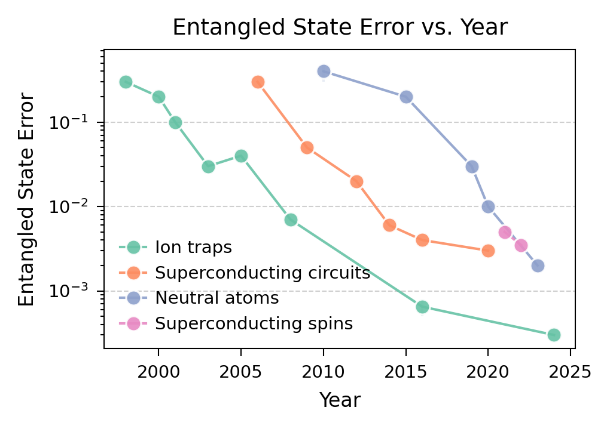
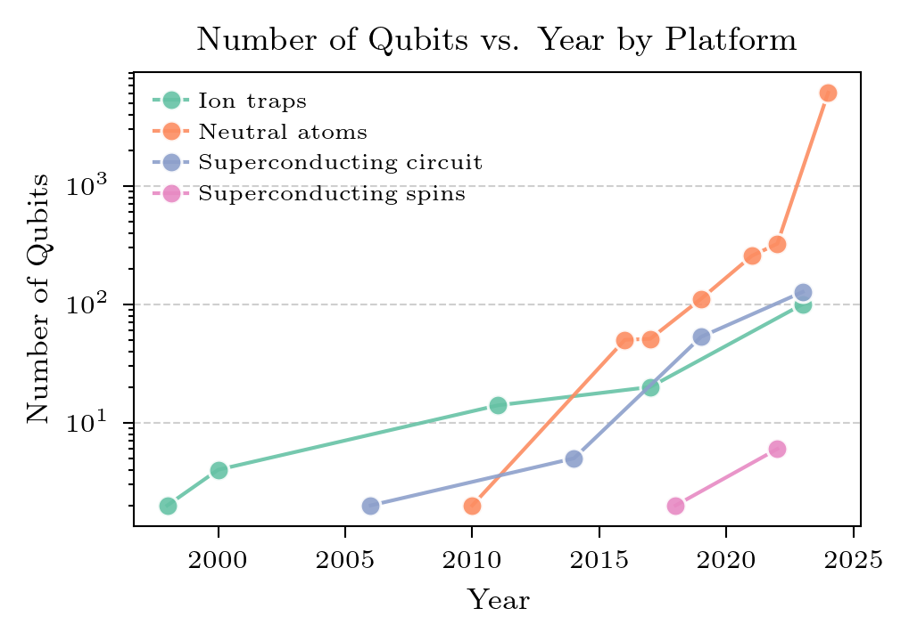
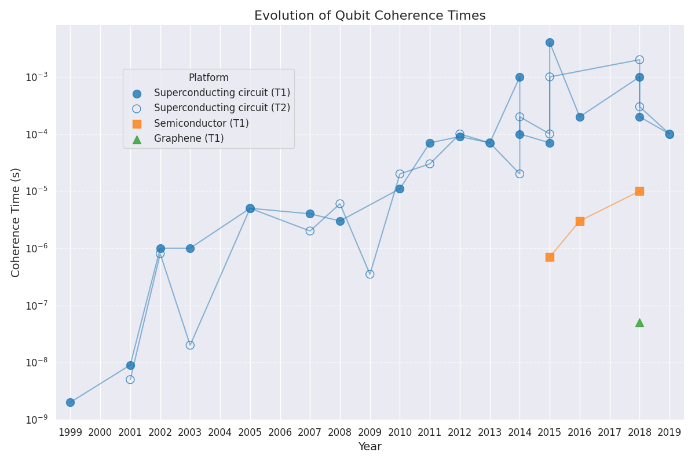

# Awesome Quantum Computing Experiments

A curated list of notable quantum computing experiments, focused primarily on the implementation of quantum error correction codes.






## Overview

This repository maintains a comprehensive database of quantum computing experiments, with a focus on:
- Quantum Error Correction (QEC) implementations
- Magic State Distillation (MSD) experiments
- Entangled State Error measurements
- Physical Qubit Count evolution

## Quick Start

1. Clone the repository and install dependencies:
```bash
git clone https://github.com/francois-marie/awesome-quantum-computing-experiments.git
cd awesome-quantum-computing-experiments
pip install -e ".[test]" # Install package and test dependencies
```

2. Generate all plots and README:
```bash
make all
```

For more detailed information:
- See [Documentation](docs/DOCUMENTATION.md) for usage and data format details
- See [Contributing Guide](docs/CONTRIBUTING.md) for how to add new experiments

## Table of Contents

- [Quantum Error Correction](#quantum-error-correction)
	- [Repetition Code](#repetition-code)
	- [[[5,1,3]] Perfect Code](#513-perfect-code)
	- [Color Code](#color-code)
	- [Surface Code](#surface-code)
	- [Bell State](#bell-state)
	- [Four-qubit Code](#four-qubit-code)
	- [Bacon-Shor Code](#bacon-shor-code)
	- [Cluster State](#cluster-state)
- [Magic State Distillation](#magic-state-distillation)
	- [5 to 1](#5-to-1)
	- [1 to 1](#1-to-1)
- [Entangled State Error](#entangled-state-error)
	- [Ion traps](#ion-traps)
	- [Superconducting circuits](#superconducting-circuits)
	- [Neutral atoms](#neutral-atoms)
	- [Superconducting spins](#superconducting-spins)
- [Qubit Count](#qubit-count)
	- [Ion traps](#ion-traps)
	- [Superconducting circuit](#superconducting-circuit)
	- [Neutral atoms](#neutral-atoms)
	- [Superconducting spins](#superconducting-spins)
- [Physical Qubits](#physical-qubits)
	- [Superconducting circuit](#superconducting-circuit)
	- [Semiconductor](#semiconductor)
	- [Graphene](#graphene)

## Quantum Error Correction

### Repetition Code

- [Experimental Quantum Error Correction](https://arxiv.org/abs/quant-ph/9802018) (1998) - [3,1,3] on NMR
- [Demonstration of Sufficient Control for Two Rounds of Quantum Error Correction in a Solid-State Ensemble Quantum Information Processor](https://arxiv.org/abs/1108.4842) (2011) - [3,1,3] on NMR
- [Experimental Repetitive Quantum Error Correction](https://jubarreiro.physics.ucsd.edu/files/Schindler-Science-332-1059-1061.pdf) (2011) - [3,1,3] on Ion traps
- [Experimental quantum error correction with high fidelity](https://arxiv.org/abs/1109.4821) (2011) - [3,1,3] on NMR
- [Realization of Three-Qubit Quantum Error Correction with Superconducting Circuits](https://arxiv.org/abs/1109.4948) (2012) - [3,1,3] on Superconducting circuit
- [Quantum error correction in a solid-state hybrid spin register](https://arxiv.org/abs/1309.6424) (2014) - [[3,1,3]] on NV centers
- [State preservation by repetitive error detection in a superconducting quantum circuit](https://arxiv.org/abs/1411.7403) (2014) - [3,1,3]-[5,1,5] on Superconducting circuit
- [Detecting bit-flip errors in a logical qubit using stabilizer measurements](https://arxiv.org/abs/1411.5542) (2015) - [3,1,3] on Superconducting circuit
- [Repeated quantum error correction on a continuously encoded qubit by real-time feedback](https://arxiv.org/abs/1508.01388) (2016) - [3,1,3] on Superconducting circuit
- [A repetition code of 15 qubits](https://arxiv.org/abs/1709.00990) (2018) - [3,1,3]-[8,1,8] on Superconducting circuit
- [Benchmarking near-term devices with quantum error correction](https://arxiv.org/abs/2004.11037) (2020) - [3,1,3]-[22,1,22] on Superconducting circuit
- [Exponential suppression of bit or phase flip errors with repetitive error correction](https://arxiv.org/abs/2102.06132) (2020) - [3,1,3]-[11,1,11] on Superconducting circuit
- [Suppressing quantum errors by scaling a surface code logical qubit](https://arxiv.org/abs/2207.06431) (2023) - [3,1,3]-[25,1,25] on Superconducting circuit, Repetition codes below threshold
- [Hardware-efficient quantum error correction using concatenated bosonic qubits](https://arxiv.org/abs/2409.13025) (2024) - [[3,1,3]], [[5,1,5]] on Superconducting circuit, Repetition cat codes below threshold
- [Quantum error correction below the surface code threshold](https://arxiv.org/abs/2408.13687) (2024) - [3,1,3]-[29,1,29] on Superconducting circuit, Repetition codes below threshold

### [[5,1,3]] Perfect Code

- [Benchmarking Quantum Computers: The Five-Qubit Error Correcting Code](https://arxiv.org/abs/quant-ph/0101034) (2001) - [[5,1,3]] on NMR
- [Experimental implementation of encoded logical qubit operations in a perfect quantum error correcting code](https://arxiv.org/abs/1208.4797) (2012) - [[5,1,3]] on NMR
- [Experimental exploration of five-qubit quantum error correcting code with superconducting qubits](https://arxiv.org/abs/1907.04507) (2019) - [[5,1,3]] on Superconducting circuit

### Color Code

- [Experimental Quantum Computations on a Topologically Encoded Qubit](https://arxiv.org/abs/1403.5426) (2014) - [[7,1,3]] on Ion traps
- [Experimental demonstration of fault-tolerant state preparation with superconducting qubits](https://arxiv.org/abs/1705.09259) (2017) - [[4,2,2]] on Superconducting circuit
- [Fault-tolerant quantum error detection](https://arxiv.org/abs/1611.06946) (2017) - [[4,2,2]] on Ion traps
- [A quantum processor based on coherent transport of entangled atom arrays](https://arxiv.org/abs/2112.03923) (2021) - [[7,1,3]] on Neutral atoms
- [Logical quantum processor based on reconfigurable atom arrays](https://arxiv.org/abs/2312.03982) (2023) - [[7,1,3]], [[8,3,2]] on Neutral atoms
- [Experimental Demonstration of Logical Magic State Distillation](https://arxiv.org/abs/2412.15165) (2024) - [[7, 1, 3]], [[17,1,5]] on Neutral atoms
- [Scaling and logic in the color code on a superconducting quantum processor](https://arxiv.org/abs/2412.14256) (2024) - [[7, 1, 3]], [[17,1,5]] on Superconducting circuit

### Surface Code

- [Experimental demonstration of a graph state quantum error-correction code](https://arxiv.org/abs/1404.5498) (2014) - [[4,1,2]] on Photons
- [Repeated Quantum Error Detection in a Surface Code](https://arxiv.org/abs/1912.09410) (2020) - [[4,1,2]] on Superconducting circuit
- [A quantum processor based on coherent transport of entangled atom arrays](https://arxiv.org/abs/2112.03923) (2021) - [[13,1,3]] surface code, [[16,2,2]] toric code on Neutral atoms
- [Realizing repeated quantum error correction in a distance-three surface code](https://arxiv.org/abs/2112.03708) (2021) - [[9,1,3]] on Superconducting circuit
- [Logical quantum processor based on reconfigurable atom arrays](https://arxiv.org/abs/2312.03982) (2023) - [[9,1,3]], [[25,1,5]], [[49,1,7]] on Neutral atoms
- [Suppressing quantum errors by scaling a surface code logical qubit](https://arxiv.org/abs/2207.06431) (2023) - [[9,1,3]]-[[25,1,5]] on Superconducting circuit, Repetition codes below threshold
- [Demonstrating dynamic surface codes](https://arxiv.org/abs/2412.14360) (2024) - [[9,1,3]], [[25,1,5]], [[49,1,7]] on Superconducting circuit
- [Quantum error correction below the surface code threshold](https://arxiv.org/abs/2408.13687) (2024) - [[9,1,3]], [[25,1,5]], [[49,1,7]] on Superconducting circuit, Surface codes below threshold

### Bell State

- [Demonstration of a quantum error detection code using a square lattice of four superconducting qubits](https://www.nature.com/articles/ncomms7979) (2015) - [[2,0,2]] on Superconducting circuit
- [Entanglement stabilization using ancilla-based parity detection and real-time feedback in superconducting circuits](https://www.nature.com/articles/s41534-019-0185-4) (2019) - [[2,0,2]] on Superconducting circuit
- [Protecting quantum entanglement from leakage and qubit errors via repetitive parity measurements](https://arxiv.org/abs/1905.12731) (2020) - [[2,0,2]] on Superconducting circuit

### Four-qubit Code

- [Experimental demonstration of fault-tolerant state preparation with superconducting qubits
](https://arxiv.org/abs/1705.09259) (2017) - [[4,1,2]] on Superconducting circuit
- [Fault-tolerant quantum error detection
](https://arxiv.org/abs/1611.06946) (2017) - [[4,1,2]] on Ion traps
- [Is error detection helpful on IBM 5Q chips ?
](https://arxiv.org/abs/1705.08957) (2018) - [[4,2,2]] on Superconducting circuit
- [Protecting quantum memories using coherent parity check codes
](https://arxiv.org/abs/1709.01866) (2018) - [[4,2,2]] on Superconducting circuit
- [Testing quantum fault tolerance on small systems
](https://arxiv.org/abs/1805.05227) (2018) - [[4,2,2]] on Superconducting circuit
- [Fault-Tolerant Logical Gates in the IBM Quantum Experience
](https://arxiv.org/abs/1806.02359) (2019) - [[4,2,2]] on Superconducting circuit
- [Error detection on quantum computers improves accuracy of chemical calculations
](https://arxiv.org/abs/1910.00129) (2020) - [[4,2,2]] on Superconducting circuit
- [Exponential suppression of bit or phase flip errors with repetitive error correction](https://arxiv.org/abs/2102.06132) (2020) - [[4,1,2]] on Superconducting circuit
- [Resource Optimal Realization of Fault-Tolerant Quantum Circuit](https://ieeexplore.ieee.org/document/9171796) (2020) - [[4,2,2]] on Superconducting circuit
- [Experimental Characterization of Fault-Tolerant Circuits in Small-Scale Quantum Processors
](https://arxiv.org/abs/2112.04076) (2021) - [[4,2,2]] on Superconducting circuit
- [Comparative analysis of error mitigation techniques for variational quantum eigensolver implementations on IBM quantum system
](https://arxiv.org/abs/2206.07907) (2022) - [[4,2,2]] on Superconducting circuit
- [Optical demonstration of quantum fault-tolerant threshold
](https://arxiv.org/abs/2012.08927) (2022) - [[4,2,2]] on Photons
- [Encoding a magic state with beyond break-even fidelity
](https://arxiv.org/abs/2305.13581) (2024) - [[4,2,2]] on Superconducting circuit
- [End-to-End Quantum Simulation of a Chemical System
](https://arxiv.org/abs/2409.05835) (2024) - [[4,2,2]] on Ion traps
- [Fault-Tolerant Operation and Materials Science with Neutral Atom Logical Qubits](https://arxiv.org/abs/2412.07670) (2024) - [[4,2,2]] on Neutral atoms
- [Logical computation demonstrated with a neutral atom quantum processor](https://arxiv.org/abs/2411.11822) (2024) - [[4,1,2]], [[4,2,2]] on Neutral atoms

### Bacon-Shor Code

- [Fault-Tolerant Operation of a Quantum Error-Correction Code](https://arxiv.org/abs/2009.11482) (2020) - [[9,1,3]] on Ion traps
- [Quantum teleportation of physical qubits into logical code-spaces](https://arxiv.org/abs/2009.06242) (2020) - [[9,1,3]] on Photons
- [Logical computation demonstrated with a neutral atom quantum processor](https://arxiv.org/abs/2411.11822) (2024) - [[9,1,3]] on Neutral atoms

### Cluster State

- [A quantum processor based on coherent transport of entangled atom arrays](https://arxiv.org/abs/2112.03923) (2021) - 1D with 12 qubits on Neutral atoms

## Magic State Distillation

### 5 to 1

- [Experimental Demonstration of Logical Magic State Distillation](https://arxiv.org/abs/2412.15165) (2024) - on Neutral atoms, Injection and distillation

### 1 to 1

- [Scaling and logic in the color code on a superconducting quantum processor](https://arxiv.org/abs/2412.14256) (2024) - on Superconducting circuit, Injection and teleportation

## Entangled State Error

### Ion traps

- [Experimental Demonstration of a Controlled-NOT Quantum Gate](https://arxiv.org/abs/quant-ph/9806012) (1998) - 0.3 on Ion traps
- [Experimental Entanglement of Four Particles](https://www.nature.com/articles/35005011) (2000) - 0.2 on Ion traps
- [Experimental Violation of a Bell's Inequality with Efficient Detection](https://www.nature.com/articles/35057215) (2001) - 0.1 on Ion traps
- [Experimental Demonstration of a Robust, High-Fidelity Geometric Two Ion-Quibit Phase Gate](https://www.nature.com/articles/nature01492) (2003) - 0.03 on Ion traps
- [Towards Fault-Tolerant Quantum Computing with Trapped Ions](https://arxiv.org/abs/0803.2798) (2008) - 0.007 on Ion traps
- [High-Fidelity Quantum Logic Gates Using Trapped Ions](https://arxiv.org/abs/1512.04600) (2016) - 0.0008 on Ion traps
- [High-Fidelity Universal Gate Set for Be+ Ion Qubits](https://arxiv.org/abs/1604.00032) (2016) - 0.0005 on Ion traps

### Superconducting circuits

- [Measurement-Based Quantum Computation with Superconducting Qubits](https://www.science.org/doi/10.1126/science.1130886) (2006) - 0.3 on Superconducting circuits
- [Demonstration of Two-Qubit Algorithms with a Superconducting Quantum Processor](https://arxiv.org/abs/0903.2030) (2009) - 0.05 on Superconducting circuits
- [Complete universal quantum gate set approaching fault-tolerant thresholds with superconducting qubits](https://arxiv.org/abs/1202.5344) (2012) - 0.02 on Superconducting circuits
- [Logic gates at the surface code threshold: Superconducting qubits poised for fault-tolerant quantum computing](https://arxiv.org/abs/1402.4848) (2014) - 0.006 on Superconducting circuits
- [Procedure for systematically tuning up crosstalk in the cross resonance gate](https://arxiv.org/abs/1603.04821) (2016) - 0.004 on Superconducting circuits
- [Programming a quantum computer with quantum instructions](https://arxiv.org/abs/2001.08838) (2020) - 0.003 on Superconducting circuits

### Neutral atoms

- [Demonstration of a neutral atom controlled-NOT quantum gate](https://arxiv.org/abs/0907.5552) (2010) - 0.3 on Neutral atoms
- [Entanglement of two individual neutral atoms using Rydberg blockade](https://arxiv.org/abs/0908.0454) (2010) - 0.5 on Neutral atoms
- [Rydberg-blockade controlled-not gate and entanglement in a two-dimensional array of neutral-atom qubits](https://journals.aps.org/pra/abstract/10.1103/PhysRevA.92.022336) (2015) - 0.2 on Neutral atoms
- [Parallel implementation of high-fidelity multi-qubit gates with neutral atoms](https://arxiv.org/abs/1908.06101) (2019) - 0.03 on Neutral atoms
- [High-Fidelity Entanglement and Detection of Alkaline-Earth Rydberg Atoms](https://arxiv.org/abs/2001.04455) (2020) - 0.01 on Neutral atoms
- [Erasure conversion in a high-fidelity Rydberg quantum simulator](https://arxiv.org/abs/2305.03406) (2023) - 0.002 on Neutral atoms

### Superconducting spins

- [Fast universal quantum control above the fault-tolerance threshold in silicon](https://arxiv.org/abs/2108.02626) (2021) - 0.005 on Superconducting spins
- [High fidelity state preparation, quantum control, and readout of an isotopically enriched silicon spin qubit](https://arxiv.org/abs/2204.09551) (2022) - nan on Superconducting spins
- [Quantum logic with spin qubits crossing the surface code threshold](https://www.nature.com/articles/s41586-021-04273-w) (2022) - 0.05 on Superconducting spins

## Qubit Count

### Ion traps

- [Experimental Demonstration of a Controlled-NOT Quantum Gate](https://arxiv.org/abs/quant-ph/9806012) (1998) - 2 qubits on Ion traps
- [Experimental Entanglement of Four Particles](https://www.nature.com/articles/35005011) (2000) - 4 qubits on Ion traps
- [14-qubit entanglement: creation and coherence](https://arxiv.org/abs/1009.6126) (2011) - 14 qubits on Ion traps
- [Observation of Entangled States of a Fully Controlled 20-Qubit System](https://arxiv.org/abs/1711.11092) (2017) - 20 qubits on Ion traps
- [Controlling two-dimensional Coulomb crystals of more than 100 ions in a monolithic radio-frequency trap](https://arxiv.org/abs/2302.00565) (2023) - 100 qubits on Ion traps

### Superconducting circuit

- [Measurement of the Entanglement of Two Superconducting Qubits via State Tomography](https://www.science.org/doi/10.1126/science.1130886) (2006) - 2 qubits on Superconducting circuit
- [Superconducting quantum circuits at the surface code threshold for fault tolerance](https://www.nature.com/articles/nature13171) (2014) - 5 qubits on Superconducting circuit
- [Quantum supremacy using a programmable superconducting processor](https://www.nature.com/articles/s41586-019-1666-5) (2019) - 53 qubits on Superconducting circuit
- [Evidence for the utility of quantum computing before fault tolerance](https://www.nature.com/articles/s41586-023-06096-3) (2023) - 127 qubits on Superconducting circuit

### Neutral atoms

- [Entanglement of two individual neutral atoms using Rydberg blockade](https://arxiv.org/abs/0908.0454) (2010) - 2 qubits on Neutral atoms
- [An atom-by-atom assembler of defect-free arbitrary 2d atomic arrays](https://arxiv.org/abs/1607.03042) (2016) - 50 qubits on Neutral atoms
- [Probing many-body dynamics on a 51-atom quantum simulator](https://arxiv.org/abs/1707.04344) (2017) - 51 qubits on Neutral atoms
- [Defect-free assembly of 2D clusters of more than 100 single-atom quantum systems](https://arxiv.org/abs/1902.00284) (2019) - 111 qubits on Neutral atoms
- [Quantum Phases of Matter on a 256-Atom Programmable Quantum Simulator](https://arxiv.org/abs/2012.12281) (2021) - 256 qubits on Neutral atoms
- [In-situ equalization of single-atom loading in large-scale optical tweezers arrays](https://arxiv.org/abs/2207.06500) (2022) - 324 qubits on Neutral atoms
- [A tweezer array with 6100 highly coherent atomic qubits](https://arxiv.org/abs/2403.12021) (2024) - 6100 qubits on Neutral atoms

### Superconducting spins

- [A programmable two-qubit quantum processor in silicon](https://arxiv.org/abs/1708.04214) (2018) - 2 qubits on Superconducting spins
- [Universal control of a six-qubit quantum processor in silicon](https://arxiv.org/abs/2202.09252) (2022) - 6 qubits on Superconducting spins

## Physical Qubits

### Superconducting circuit

- [Coherent control of macroscopic quantum states in a single-Cooper-pair box](https://arxiv.org/abs/cond-mat/9904003v1) (1999) - Cooper-pair box, T1: 2e-09s on Superconducting circuit
- Cooper-pair box (2001) - Cooper-pair box, T1: 9e-09s, T2: 5e-09s on Superconducting circuit
- [Manipulating the Quantum State of an Electrical Circuit](https://arxiv.org/abs/cond-mat/0205343) (2002) - Quantronium, T1: 1e-06s, T2: 8e-07s on Superconducting circuit
- Flux qubit (2003) - Flux qubit, T1: 1e-06s, T2: 2e-08s on Superconducting circuit
- Flux qubit (2005) - Flux qubit, T1: 5e-06s, T2: 5e-06s on Superconducting circuit
- [Suppressing Charge Noise Decoherence in Superconducting Charge Qubits](https://arxiv.org/abs/0712.3581) (2007) - Transmon, T1: 4e-06s, T2: 2e-06s on Superconducting circuit
- Fock (2D) (2008) - Fock (2D), T1: 3e-06s, T2: 6e-06s on Superconducting circuit
- [Fluxonium: single Cooper pair circuit free of charge offsets](https://arxiv.org/abs/0906.0831) (2009) - Fluxonium, T2: 3.5e-07s on Superconducting circuit
- Flux qubit (2010) - Flux qubit, T1: 1.1e-05s, T2: 2e-05s on Superconducting circuit
- Transmon (3D) (2011) - Transmon (3D), T1: 7e-05s, T2: 3e-05s on Superconducting circuit
- Transmon (3D) (2012) - Transmon (3D), T1: 9e-05s, T2: 0.0001s on Superconducting circuit
- Transmon (2013) - Transmon, T1: 7e-05s, T2: 7e-05s on Superconducting circuit
- Fluxonium (3D) (2014) - Fluxonium (3D), T1: 0.001s, T2: 2e-05s on Superconducting circuit
- Transmon (3D) (2014) - Transmon (3D), T1: 0.0001s, T2: 0.0002s on Superconducting circuit
- C-sh. flux qubit (2015) - C-sh. flux qubit, T1: 7e-05s, T2: 0.0001s on Superconducting circuit
- Fock (3D) (2015) - Fock (3D), T1: 0.004s, T2: 0.001s on Superconducting circuit
- Cat encoding (2016) - Cat encoding, T1: 0.0002s on Superconducting circuit
- Fock (3D) (2018) - Fock (3D), T1: 0.001s, T2: 0.002s on Superconducting circuit
- Fluxonium (3D) (2018) - Fluxonium (3D), T1: 0.0002s, T2: 0.0003s on Superconducting circuit
- Binomial encoding (2019) - Binomial encoding, T1: 0.0001s, T2: 0.0001s on Superconducting circuit

### Semiconductor

- Gatemon (2015) - Gatemon, T1: 7e-07s on Semiconductor
- Gatemon (2016) - Gatemon, T1: 3e-06s on Semiconductor
- Gatemon (2018) - Gatemon, T1: 1e-05s on Semiconductor

### Graphene

- Gatemon (2018) - Gatemon, T1: 5e-08s on Graphene


## Contributing

Contributions are welcome! If you have suggestions for new entries, please submit a pull request or open an issue.

## License

This work is licensed under a [CC0 1.0 Universal (Public Domain Dedication)](LICENSE).
To the extent possible under law, the authors have dedicated all copyright and related and neighboring rights to this work to the public domain worldwide.
For more information, see [Creative Commons CC0 1.0 Legal Code](https://creativecommons.org/publicdomain/zero/1.0/).
