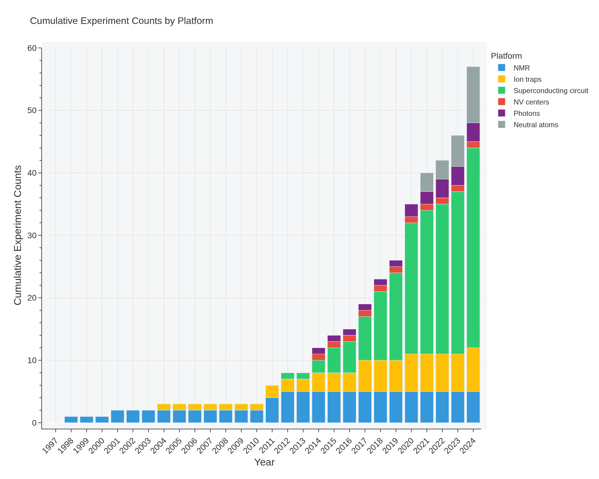
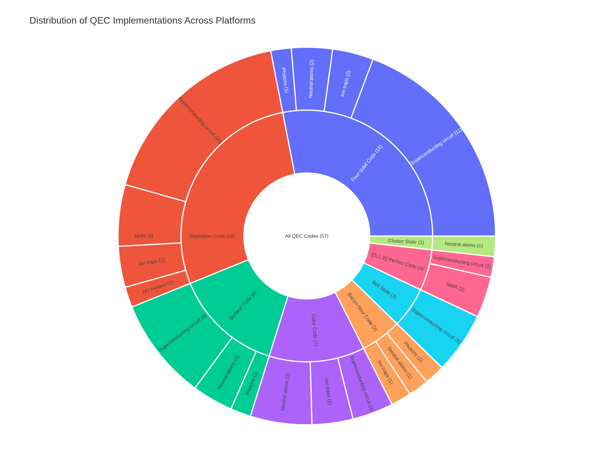
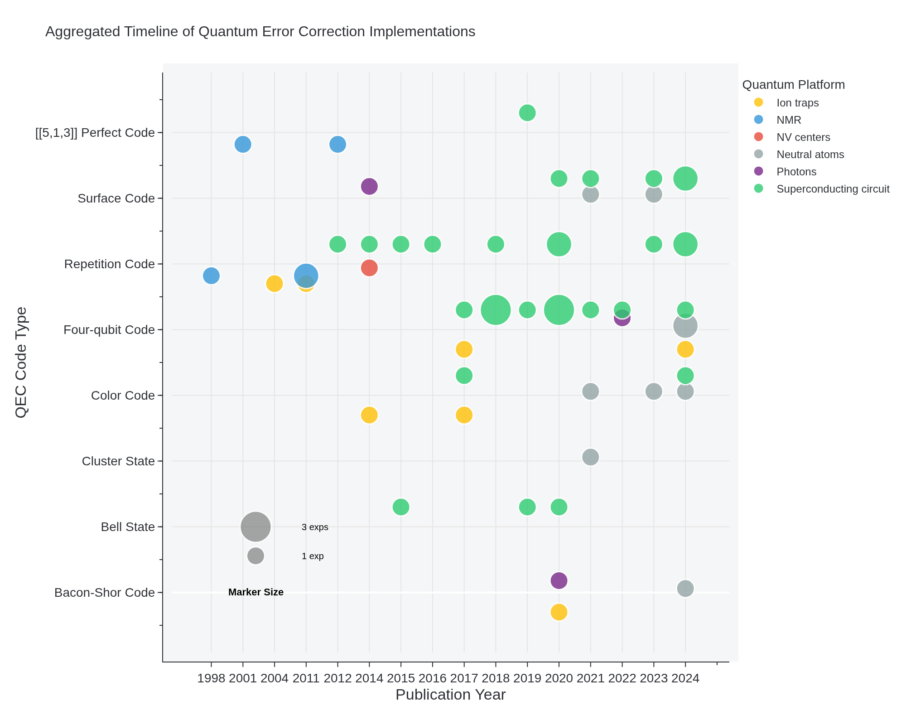
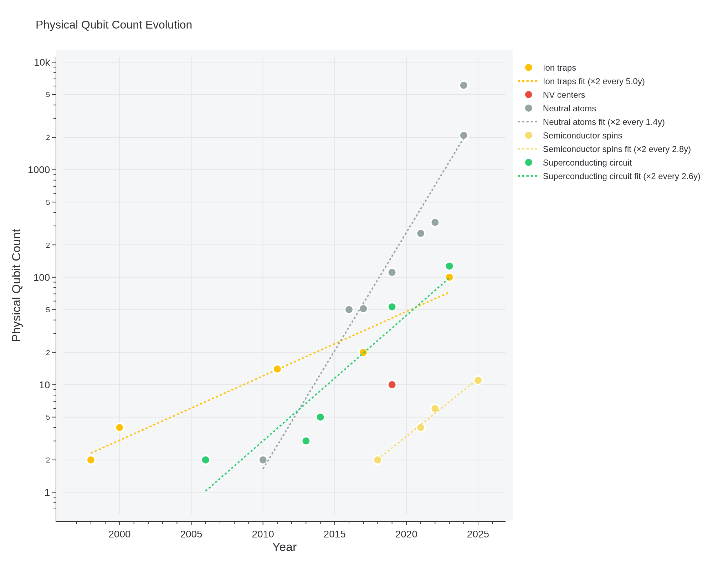
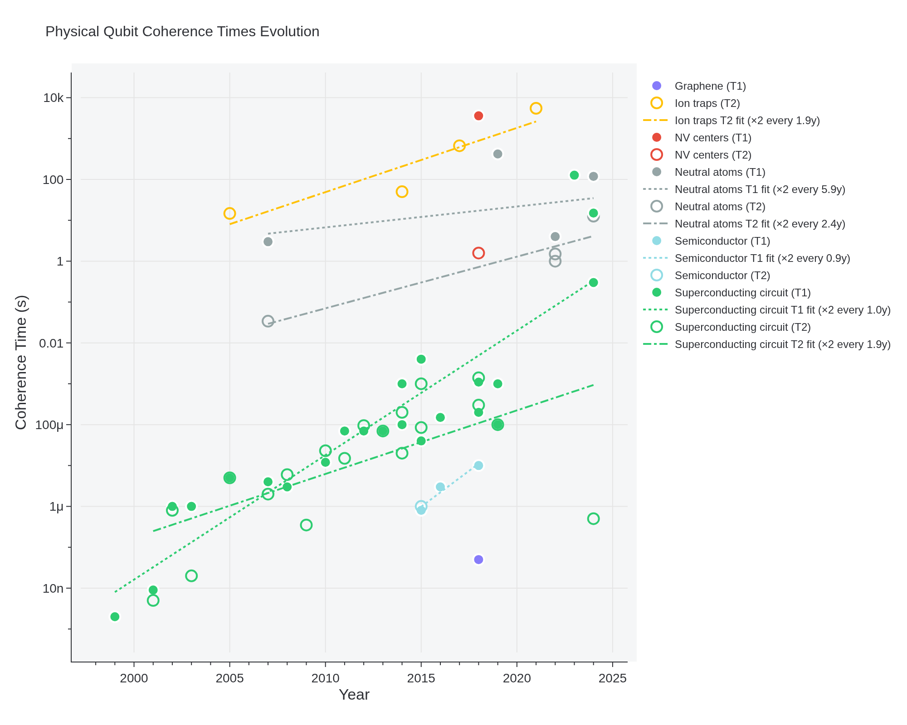
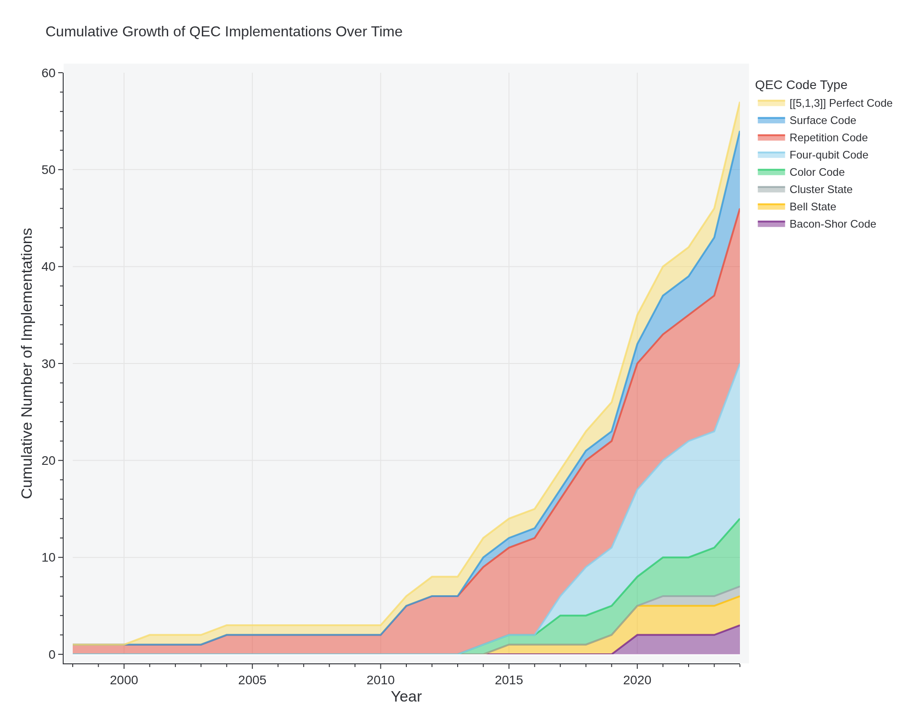

# Awesome Quantum Computing Experiments

<div style="text-align: center; font-style: italic; margin: 20px 0;">
A comprehensive database of notable quantum computing experiments, with emphasis on quantum error correction implementations
</div>

<hr style="border: 0; height: 1px; background: #333; background-image: linear-gradient(to right, #ccc, #333, #ccc);">

## Overview

<div style="background-color: #f8f9fa; padding: 15px; border-radius: 5px; border-left: 3px solid #007bff;">
This repository maintains a comprehensive database of quantum computing experiments, with a focus on:

- Quantum Error Correction (QEC) implementations
- Magic State Distillation (MSD) experiments
- Entangled State Error measurements
- Physical Qubit Count evolution
- Relaxation and Coherence Times (see [Superconducting Qubits: Current State of Play](https://arxiv.org/abs/1905.13641))
</div>

<hr style="margin: 30px 0;">

## Quick Start

<div style="background-color: #f8f9fa; padding: 15px; border-radius: 5px;">

1. Clone the repository and install dependencies:
```bash
git clone https://github.com/francois-marie/awesome-quantum-computing-experiments.git
cd awesome-quantum-computing-experiments
pip install -e ".[test]" # Install package and test dependencies
```

2. Generate all plots and README:
```bash
make all
```

For more detailed information:
- See [Documentation](docs/DOCUMENTATION.md) for usage and data format details
- See [Contributing Guide](docs/CONTRIBUTING.md) for how to add new experiments
</div>

<hr style="margin: 30px 0;">

## Local Development

<div style="background-color: #f8f9fa; padding: 15px; border-radius: 5px;">

1. Set up Ruby environment using rbenv:
```bash
eval "$(rbenv init -)"
rbenv shell 3.1.0
```

2. Install Ruby dependencies:
```bash
bundle install
```

3. Run Jekyll server:
```bash
bundle exec jekyll clean
bundle exec jekyll serve --baseurl="/awesome-quantum-computing-experiments" --livereload
```

The site will be available at `http://localhost:4000/awesome-quantum-computing-experiments/`.
</div>

<hr style="margin: 30px 0;">

## Visualizations

<div style="background-color: #f8f9fa; padding: 20px; border-radius: 5px; margin: 20px 0;">

<h4>Generating Visualizations</h4>
All visualizations can be regenerated at any time using:

```bash
# Generate all plots
make plots

# Or use the consolidated generation script
make generate_all
```

<h4>Available Visualizations</h4>
After generation, plots will be available in multiple formats:

- PNG format in the `out/png` directory (for web display)
- PDF format in the `out/pdf` directory (for publication)
- JavaScript in the `out/js` directory (for interactive web display)

<h4>Plot Gallery</h4>

The following PNG files are included in the repository to display in this README:








![[[n, k, d]] Distribution](out/png/nkd_plot_aggregated.png)








</div>

## Table of Contents

- [Quantum Error Correction](#quantum-error-correction)
	- [Repetition Code](#repetition-code)
	- [[[5,1,3]] Perfect Code](#513-perfect-code)
	- [Color Code](#color-code)
	- [Surface Code](#surface-code)
	- [Bell State](#bell-state)
	- [Four-qubit Code](#four-qubit-code)
	- [Bacon-Shor Code](#bacon-shor-code)
	- [Cluster State](#cluster-state)
- [Magic State Distillation](#magic-state-distillation)
	- [5 to 1](#5-to-1)
	- [1 to 1](#1-to-1)
- [Entangled State Error](#entangled-state-error)
	- [Ion traps](#ion-traps)
	- [Superconducting circuits](#superconducting-circuits)
	- [Neutral atoms](#neutral-atoms)
	- [Semiconductor spins](#semiconductor-spins)
- [Qubit Count](#qubit-count)
	- [Ion traps](#ion-traps)
	- [Superconducting circuit](#superconducting-circuit)
	- [Neutral atoms](#neutral-atoms)
	- [Semiconductor spins](#semiconductor-spins)
	- [NV centers](#nv-centers)
- [Physical Qubits](#physical-qubits)
	- [Superconducting circuit](#superconducting-circuit)
	- [Ion traps](#ion-traps)
	- [Neutral atoms](#neutral-atoms)
	- [Semiconductor](#semiconductor)
	- [NV centers](#nv-centers)
	- [Graphene](#graphene)

## Quantum Error Correction

### Repetition Code

- [Experimental Quantum Error Correction](https://arxiv.org/abs/quant-ph/9802018) (1998) - [3,1,3], d=1 on NMR
- [Realization of quantum error correction](https://doi.org/10.1038/nature03074) (2004) - [3,1,3], d=1 on Ion traps
- [Demonstration of Sufficient Control for Two Rounds of Quantum Error Correction in a Solid-State Ensemble Quantum Information Processor](https://arxiv.org/abs/1108.4842) (2011) - [3,1,3], d=1 on NMR
- [Experimental Repetitive Quantum Error Correction](https://jubarreiro.physics.ucsd.edu/files/Schindler-Science-332-1059-1061.pdf) (2011) - [3,1,3], d=1 on Ion traps
- [Experimental quantum error correction with high fidelity](https://arxiv.org/abs/1109.4821) (2011) - [3,1,3], d=1 on NMR
- [Realization of Three-Qubit Quantum Error Correction with Superconducting Circuits](https://arxiv.org/abs/1109.4948) (2012) - [3,1,3], d=1 on Superconducting circuit
- [Quantum error correction in a solid-state hybrid spin register](https://arxiv.org/abs/1309.6424) (2014) - [[3,1,3]] on NV centers
- [State preservation by repetitive error detection in a superconducting quantum circuit](https://arxiv.org/abs/1411.7403) (2014) - [3,1,3]-[5,1,5], d=1 on Superconducting circuit
- [Detecting bit-flip errors in a logical qubit using stabilizer measurements](https://arxiv.org/abs/1411.5542) (2015) - [3,1,3], d=1 on Superconducting circuit
- [Repeated quantum error correction on a continuously encoded qubit by real-time feedback](https://arxiv.org/abs/1508.01388) (2016) - [3,1,3], d=1 on Superconducting circuit
- [A repetition code of 15 qubits](https://arxiv.org/abs/1709.00990) (2018) - [3,1,3]-[8,1,8], d=1 on Superconducting circuit
- [Benchmarking near-term devices with quantum error correction](https://arxiv.org/abs/2004.11037) (2020) - [3,1,3]-[22,1,22], d=1 on Superconducting circuit
- [Exponential suppression of bit or phase flip errors with repetitive error correction](https://arxiv.org/abs/2102.06132) (2020) - [3,1,3]-[11,1,11], d=1 on Superconducting circuit
- [Suppressing quantum errors by scaling a surface code logical qubit](https://arxiv.org/abs/2207.06431) (2023) - [3,1,3]-[25,1,25], d=1 on Superconducting circuit, Repetition codes below threshold
- [Hardware-efficient quantum error correction using concatenated bosonic qubits](https://arxiv.org/abs/2409.13025) (2024) - [[3,1,3]], [[5,1,5]] on Superconducting circuit, Repetition cat codes below threshold
- [Quantum error correction below the surface code threshold](https://arxiv.org/abs/2408.13687) (2024) - [3,1,3]-[29,1,29], d=1 on Superconducting circuit, Repetition codes below threshold

### [[5,1,3]] Perfect Code

- [Benchmarking Quantum Computers: The Five-Qubit Error Correcting Code](https://arxiv.org/abs/quant-ph/0101034) (2001) - [[5,1,3]] on NMR
- [Experimental implementation of encoded logical qubit operations in a perfect quantum error correcting code](https://arxiv.org/abs/1208.4797) (2012) - [[5,1,3]] on NMR
- [Experimental exploration of five-qubit quantum error correcting code with superconducting qubits](https://arxiv.org/abs/1907.04507) (2019) - [[5,1,3]] on Superconducting circuit

### Color Code

- [Experimental Quantum Computations on a Topologically Encoded Qubit](https://arxiv.org/abs/1403.5426) (2014) - [[7,1,3]] on Ion traps
- [Experimental demonstration of fault-tolerant state preparation with superconducting qubits](https://arxiv.org/abs/1705.09259) (2017) - [[4,2,2]] on Superconducting circuit
- [Fault-tolerant quantum error detection](https://arxiv.org/abs/1611.06946) (2017) - [[4,2,2]] on Ion traps
- [A quantum processor based on coherent transport of entangled atom arrays](https://arxiv.org/abs/2112.03923) (2021) - [[7,1,3]] on Neutral atoms
- [Logical quantum processor based on reconfigurable atom arrays](https://arxiv.org/abs/2312.03982) (2023) - [[7,1,3]], [[8,3,2]] on Neutral atoms
- [Experimental Demonstration of Logical Magic State Distillation](https://arxiv.org/abs/2412.15165) (2024) - [[7, 1, 3]], [[17,1,5]] on Neutral atoms
- [Scaling and logic in the color code on a superconducting quantum processor](https://arxiv.org/abs/2412.14256) (2024) - [[7, 1, 3]], [[17,1,5]] on Superconducting circuit

### Surface Code

- [Experimental demonstration of a graph state quantum error-correction code](https://arxiv.org/abs/1404.5498) (2014) - [[4,1,2]] on Photons
- [Repeated Quantum Error Detection in a Surface Code](https://arxiv.org/abs/1912.09410) (2020) - [[4,1,2]] on Superconducting circuit
- [A quantum processor based on coherent transport of entangled atom arrays](https://arxiv.org/abs/2112.03923) (2021) - [[13,1,3]] surface code, [[16,2,2]] toric code on Neutral atoms
- [Realizing repeated quantum error correction in a distance-three surface code](https://arxiv.org/abs/2112.03708) (2021) - [[9,1,3]] on Superconducting circuit
- [Logical quantum processor based on reconfigurable atom arrays](https://arxiv.org/abs/2312.03982) (2023) - [[9,1,3]], [[25,1,5]], [[49,1,7]] on Neutral atoms
- [Suppressing quantum errors by scaling a surface code logical qubit](https://arxiv.org/abs/2207.06431) (2023) - [[9,1,3]]-[[25,1,5]] on Superconducting circuit, Repetition codes below threshold
- [Demonstrating dynamic surface codes](https://arxiv.org/abs/2412.14360) (2024) - [[9,1,3]], [[25,1,5]] on Superconducting circuit
- [Quantum error correction below the surface code threshold](https://arxiv.org/abs/2408.13687) (2024) - [[9,1,3]], [[25,1,5]], [[49,1,7]] on Superconducting circuit, Surface codes below threshold

### Bell State

- [Demonstration of a quantum error detection code using a square lattice of four superconducting qubits](https://www.nature.com/articles/ncomms7979) (2015) - [[2,0,2]] on Superconducting circuit
- [Entanglement stabilization using ancilla-based parity detection and real-time feedback in superconducting circuits](https://www.nature.com/articles/s41534-019-0185-4) (2019) - [[2,0,2]] on Superconducting circuit
- [Protecting quantum entanglement from leakage and qubit errors via repetitive parity measurements](https://arxiv.org/abs/1905.12731) (2020) - [[2,0,2]] on Superconducting circuit

### Four-qubit Code

- [Experimental demonstration of fault-tolerant state preparation with superconducting qubits](https://arxiv.org/abs/1705.09259) (2017) - [[4,1,2]] on Superconducting circuit
- [Fault-tolerant quantum error detection](https://arxiv.org/abs/1611.06946) (2017) - [[4,1,2]] on Ion traps
- [Is error detection helpful on IBM 5Q chips ?](https://arxiv.org/abs/1705.08957) (2018) - [[4,2,2]] on Superconducting circuit
- [Protecting quantum memories using coherent parity check codes](https://arxiv.org/abs/1709.01866) (2018) - [[4,2,2]] on Superconducting circuit
- [Testing quantum fault tolerance on small systems](https://arxiv.org/abs/1805.05227) (2018) - [[4,2,2]] on Superconducting circuit
- [Fault-Tolerant Logical Gates in the IBM Quantum Experience](https://arxiv.org/abs/1806.02359) (2019) - [[4,2,2]] on Superconducting circuit
- [Error detection on quantum computers improves accuracy of chemical calculations](https://arxiv.org/abs/1910.00129) (2020) - [[4,2,2]] on Superconducting circuit
- [Exponential suppression of bit or phase flip errors with repetitive error correction](https://arxiv.org/abs/2102.06132) (2020) - [[4,1,2]] on Superconducting circuit
- [Resource Optimal Realization of Fault-Tolerant Quantum Circuit](https://ieeexplore.ieee.org/document/9171796) (2020) - [[4,2,2]] on Superconducting circuit
- [Experimental Characterization of Fault-Tolerant Circuits in Small-Scale Quantum Processors](https://arxiv.org/abs/2112.04076) (2021) - [[4,2,2]] on Superconducting circuit
- [Comparative analysis of error mitigation techniques for variational quantum eigensolver implementations on IBM quantum system](https://arxiv.org/abs/2206.07907) (2022) - [[4,2,2]] on Superconducting circuit
- [Optical demonstration of quantum fault-tolerant threshold](https://arxiv.org/abs/2012.08927) (2022) - [[4,2,2]] on Photons
- [Encoding a magic state with beyond break-even fidelity](https://arxiv.org/abs/2305.13581) (2024) - [[4,2,2]] on Superconducting circuit
- [End-to-End Quantum Simulation of a Chemical System](https://arxiv.org/abs/2409.05835) (2024) - [[4,2,2]] on Ion traps, Error detection yielded a 3% rejection
rate and the use of teleportation flags was responsible for the additional 50% rejection rate.
- [Fault-Tolerant Operation and Materials Science with Neutral Atom Logical Qubits](https://arxiv.org/abs/2412.07670) (2024) - [[4,2,2]] on Neutral atoms
- [Logical computation demonstrated with a neutral atom quantum processor](https://arxiv.org/abs/2411.11822) (2024) - [[4,1,2]], [[4,2,2]] on Neutral atoms

### Bacon-Shor Code

- [Fault-Tolerant Operation of a Quantum Error-Correction Code](https://arxiv.org/abs/2009.11482) (2020) - [[9,1,3]] on Ion traps
- [Quantum teleportation of physical qubits into logical code-spaces](https://arxiv.org/abs/2009.06242) (2020) - [[9,1,3]] on Photons
- [Logical computation demonstrated with a neutral atom quantum processor](https://arxiv.org/abs/2411.11822) (2024) - [[9,1,3]] on Neutral atoms

### Cluster State

- [A quantum processor based on coherent transport of entangled atom arrays](https://arxiv.org/abs/2112.03923) (2021) - 1D with 12 qubits on Neutral atoms

## Magic State Distillation

### 5 to 1

- [Experimental Demonstration of Logical Magic State Distillation](https://arxiv.org/abs/2412.15165) (2024) - on Neutral atoms, Injection and distillation

### 1 to 1

- [Scaling and logic in the color code on a superconducting quantum processor](https://arxiv.org/abs/2412.14256) (2024) - on Superconducting circuit, Injection and teleportation

## Entangled State Error

### Ion traps

- [Deterministic entanglement of two trapped ions](https://arxiv.org/abs/quant-ph/9806012) (1998) - 0.3 on Ion traps, Bell state error
- [Experimental Entanglement of Four Particles](https://www.nature.com/articles/35005011) (2000) - 0.17 on Ion traps, entangled state error
- [Experimental Violation of a Bell's Inequality with Efficient Detection](https://www.nature.com/articles/35057215) (2001) - 0.1 on Ion traps, Bell state error
- [Experimental demonstration of a robust, high-fidelity geometric two ion-qubit phase gate](https://www.nature.com/articles/nature01492) (2003) - 0.03 on Ion traps, Bell state error
- [Robust entanglement](https://doi.org/10.1007/s00340-005-1917-z) (2005) - 0.04 on Ion traps, Bell state error
- [Towards Fault-Tolerant Quantum Computing with Trapped Ions](https://arxiv.org/abs/0803.2798) (2008) - 0.007 on Ion traps, Mølmer-Sørensen gate error
- [High-Fidelity Universal Gate Set for $^9$Be$^+$ Ion Qubits](https://arxiv.org/abs/1604.00032) (2016) - 0.0005 on Ion traps, two-qubit gate error
- [High-fidelity quantum logic gates using trapped-ion hyperfine qubits](https://arxiv.org/abs/1512.04600) (2016) - 0.0008 on Ion traps, two-qubit gate error
- [Scalable, high-fidelity all-electronic control of trapped-ion qubits](https://arxiv.org/abs/2407.07694) (2024) - 0.0003 on Ion traps, Two-qubit maximally entangled states

### Superconducting circuits

- [Measurement of the Entanglement of Two Superconducting Qubits via State Tomography](https://www.science.org/doi/10.1126/science.1130886) (2006) - 0.13 on Superconducting circuits, entangled Bell state error
- [Demonstration of Two-Qubit Algorithms with a Superconducting Quantum Processor](https://arxiv.org/abs/0903.2030) (2009) - 0.05 on Superconducting circuits, entangled state error
- [Complete universal quantum gate set approaching fault-tolerant thresholds with superconducting qubits](https://arxiv.org/abs/1202.5344) (2012) - 0.02 on Superconducting circuits, CNOT gate error
- [Logic gates at the surface code threshold: Superconducting qubits poised for fault-tolerant quantum computing](https://arxiv.org/abs/1402.4848) (2014) - 0.006 on Superconducting circuits, CZ gate error
- [Procedure for systematically tuning up crosstalk in the cross resonance gate](https://arxiv.org/abs/1603.04821) (2016) - 0.009 on Superconducting circuits, cross resonance gate error
- [Programming a quantum computer with quantum instructions](https://arxiv.org/abs/2001.08838) (2020) - 0.003 on Superconducting circuits, controlled-phase gate error

### Neutral atoms

- [Demonstration of a neutral atom controlled-NOT quantum gate](https://arxiv.org/abs/0907.5552) (2010) - 0.27 on Neutral atoms, CNOT gate error
- [Entanglement of two individual neutral atoms using Rydberg blockade](https://arxiv.org/abs/0908.0454) (2010) - 0.25 on Neutral atoms, entangled state error
- [Rydberg-blockade controlled-not gate and entanglement in a two-dimensional array of neutral-atom qubits](https://journals.aps.org/pra/abstract/10.1103/PhysRevA.92.022336) (2015) - 0.21 on Neutral atoms, post-selected entanglement error on X operation conditioned on the control qubit being in state |0〉
- [Parallel implementation of high-fidelity multi-qubit gates with neutral atoms](https://arxiv.org/abs/1908.06101) (2019) - 0.03 on Neutral atoms, CZ gate error
- [High-Fidelity Entanglement and Detection of Alkaline-Earth Rydberg Atoms](https://arxiv.org/abs/2001.04455) (2020) - 0.01 on Neutral atoms, Bell state error, SPAM-corrected
- [Erasure conversion in a high-fidelity Rydberg quantum simulator](https://arxiv.org/abs/2305.03406) (2023) - 0.002 on Neutral atoms, Rydberg entangling operation error
- [High-fidelity parallel entangling gates on a neutral-atom quantum computer](https://doi.org/10.1038/s41586-023-06481-y) (2023) - 0.005 on Neutral atoms, Rb, CZ gate
- [High-fidelity universal gates in the 171Yb ground state nuclear spin qubit](https://doi.org/10.48550/arXiv.2411.11708) (2024) - 0.006 on Neutral atoms, Yb, CZ gate
- [A universal neutral-atom quantum computer with individual optical addressing and non-destructive readout](https://doi.org/10.48550/arXiv.2408.08288) (2025) - 0.0066 on Neutral atoms, Cs, CZ gate
- [Benchmarking and Fidelity Response Theory of High-Fidelity Rydberg Entangling Gates](https://doi.org/10.1103/PRXQuantum.6.010331) (2025) - 0.0029 on Neutral atoms, Sr, CZ gate
- [Spectroscopy and Modeling of 171Yb Rydberg States for High-Fidelity Two-Qubit Gates](https://doi.org/10.1103/PhysRevX.15.011009) (2025) - 0.006 on Neutral atoms, Yb, CZ gate

### Semiconductor spins

- [Fidelity benchmarks for two-qubit gates in silicon](https://doi.org/10.1038/s41586-019-1197-0) (2019) - 0.02 on Semiconductor spins, average controlled-rotation gate error
- [Fast universal quantum control above the fault-tolerance threshold in silicon](https://arxiv.org/abs/2108.02626) (2021) - 0.005 on Semiconductor spins, CNOT gate
- [Quantum logic with spin qubits crossing the surface code threshold](https://www.nature.com/articles/s41586-021-04273-w) (2022) - 0.0035 on Semiconductor spins, CZ gate

## Qubit Count

### Ion traps

- [Experimental Demonstration of a Controlled-NOT Quantum Gate](https://arxiv.org/abs/quant-ph/9806012) (1998) - 2 qubits on Ion traps
- [Experimental Entanglement of Four Particles](https://www.nature.com/articles/35005011) (2000) - 4 qubits on Ion traps
- [14-qubit entanglement: creation and coherence](https://arxiv.org/abs/1009.6126) (2011) - 14 qubits on Ion traps
- [Observation of Entangled States of a Fully Controlled 20-Qubit System](https://arxiv.org/abs/1711.11092) (2017) - 20 qubits on Ion traps
- [Controlling two-dimensional Coulomb crystals of more than 100 ions in a monolithic radio-frequency trap](https://arxiv.org/abs/2302.00565) (2023) - 100 qubits on Ion traps

### Superconducting circuit

- [Measurement of the Entanglement of Two Superconducting Qubits via State Tomography](https://www.science.org/doi/10.1126/science.1130886) (2006) - 2 qubits on Superconducting circuit
- [Implementing a strand of a scalable fault-tolerant quantum computing fabric](https://doi.org/10.1038/ncomms5015) (2013) - 3 qubits on Superconducting circuit
- [Superconducting quantum circuits at the surface code threshold for fault tolerance](https://www.nature.com/articles/nature13171) (2014) - 5 qubits on Superconducting circuit
- [Quantum supremacy using a programmable superconducting processor](https://www.nature.com/articles/s41586-019-1666-5) (2019) - 53 qubits on Superconducting circuit
- [Evidence for the utility of quantum computing before fault tolerance](https://www.nature.com/articles/s41586-023-06096-3) (2023) - 127 qubits on Superconducting circuit

### Neutral atoms

- [Entanglement of two individual neutral atoms using Rydberg blockade](https://arxiv.org/abs/0908.0454) (2010) - 2 qubits on Neutral atoms
- [An atom-by-atom assembler of defect-free arbitrary 2d atomic arrays](https://arxiv.org/abs/1607.03042) (2016) - 50 qubits on Neutral atoms
- [Probing many-body dynamics on a 51-atom quantum simulator](https://arxiv.org/abs/1707.04344) (2017) - 51 qubits on Neutral atoms
- [Defect-free assembly of 2D clusters of more than 100 single-atom quantum systems](https://arxiv.org/abs/1902.00284) (2019) - 111 qubits on Neutral atoms
- [Quantum Phases of Matter on a 256-Atom Programmable Quantum Simulator](https://arxiv.org/abs/2012.12281) (2021) - 256 qubits on Neutral atoms
- [In-situ equalization of single-atom loading in large-scale optical tweezers arrays](https://arxiv.org/abs/2207.06500) (2022) - 324 qubits on Neutral atoms
- [A tweezer array with 6100 highly coherent atomic qubits](https://arxiv.org/abs/2403.12021) (2024) - 6100 qubits on Neutral atoms, Not rearranged
- [AI-Enabled Rapid Assembly of Thousands of Defect-Free Neutral Atom Arrays with Constant-time-overhead](https://doi.org/10.48550/arXiv.2412.14647) (2024) - 2024 qubits on Neutral atoms, Defect-free 2D and 3D atom arrays
- [Rearrangement of individual atoms in a 2000-site optical-tweezer array at cryogenic temperatures](https://doi.org/10.1103/PhysRevApplied.22.024073) (2024) - 2088 qubits on Neutral atoms, Cryogenic environment at 6K

### Semiconductor spins

- [A programmable two-qubit quantum processor in silicon](https://arxiv.org/abs/1708.04214) (2018) - 2 qubits on Semiconductor spins
- [A four-qubit germanium quantum processor](https://doi.org/10.1038/s41586-021-03332-6) (2021) - 4 qubits on Semiconductor spins
- [Universal control of a six-qubit quantum processor in silicon](https://arxiv.org/abs/2202.09252) (2022) - 6 qubits on Semiconductor spins

### NV centers

- [A Ten-Qubit Solid-State Spin Register with Quantum Memory up to One Minute](https://doi.org/10.1103/PhysRevX.9.031045) (2019) - 10 qubits on NV centers

## Physical Qubits

### Superconducting circuit

- [Coherent control of macroscopic quantum states in a single-Cooper-pair box](https://arxiv.org/abs/cond-mat/9904003v1) (1999) - Cooper-pair box, T1: 2e-09s on Superconducting circuit
- [Charge echo in a Cooper-pair box](https://arxiv.org/abs/cond-mat/0111402) (2001) - Cooper-pair box, T1: 9e-09s, T2: 5e-09s on Superconducting circuit
- [Manipulating the Quantum State of an Electrical Circuit](https://arxiv.org/abs/cond-mat/0205343) (2002) - Quantronium, T1: 1e-06s, T2: 8e-07s on Superconducting circuit
- [Coherent Quantum Dynamics of a Superconducting Flux Qubit](https://arxiv.org/abs/cond-mat/0305461) (2003) - Flux qubit, T1: 1e-06s, T2: 2e-08s on Superconducting circuit
- [Dephasing of a superconducting qubit induced by photon noise](https://arxiv.org/abs/cond-mat/0512428) (2005) - Flux qubit, T1: 5e-06s, T2: 5e-06s on Superconducting circuit
- [Controlling the spontaneous emission of a superconducting transmon qubit](https://arxiv.org/abs/0803.4490) (2007) - Transmon, T1: 4e-06s, T2: 2e-06s on Superconducting circuit
- [Measurement of the decay of Fock states in a superconducting quantum circuit](https://arxiv.org/abs/0808.3279) (2008) - Fock (2D), T1: 3e-06s, T2: 6e-06s on Superconducting circuit
- [Fluxonium: single Cooper pair circuit free of charge offsets](https://arxiv.org/abs/0906.0831) (2009) - Fluxonium, T2: 3.5e-07s on Superconducting circuit
- [Dynamical decoupling and noise spectroscopy with a superconducting flux qubit](https://arxiv.org/abs/1101.4707) (2010) - Flux qubit, T1: 1.2e-05s, T2: 2.3e-05s on Superconducting circuit
- [Observation of high coherence in Josephson junction qubits measured in a three-dimensional circuit QED architecture](https://arxiv.org/abs/1105.4652) (2011) - Transmon (3D), T1: 7e-05s, T2: 1.5e-05s on Superconducting circuit
- [Superconducting qubit in waveguide cavity with coherence time approaching 0.1ms](https://arxiv.org/abs/1202.5533) (2012) - Transmon (3D), T1: 7e-05s, T2: 9.5e-05s on Superconducting circuit
- [Improved superconducting qubit coherence using titanium nitride](https://arxiv.org/abs/1303.4071) (2013) - Transmon, T1: 7e-05s, T2: 7e-05s on Superconducting circuit
- [Coherent suppression of electromagnetic dissipation due to superconducting quasiparticles](https://www.nature.com/articles/nature13017) (2014) - Fluxonium (3D), T1: 0.001s, T2: 2e-05s on Superconducting circuit
- [Thermal and Residual Excited-State Population in a 3D Transmon Qubit](https://arxiv.org/abs/1412.2772) (2014) - Transmon (3D), T1: 0.0001s, T2: 0.0002s on Superconducting circuit
- [A Schrodinger Cat Living in Two Boxes](https://arxiv.org/abs/1601.05505) (2015) - Fock (3D), T1: 0.004s, T2: 0.001s on Superconducting circuit
- [The Flux Qubit Revisited to Enhance Coherence and Reproducibility](https://arxiv.org/abs/1508.06299) (2015) - C-sh. flux qubit, T1: 4e-05s, T2: 8.5e-05s on Superconducting circuit
- [Demonstrating Quantum Error Correction that Extends the Lifetime of Quantum Information](https://arxiv.org/abs/1602.04768v1) (2016) - Cat encoding, T1: 0.00015s on Superconducting circuit, The enhanced lifetime of the encoded information is 320µs without any post-selection.
- [Fault-tolerant detection of a quantum error](https://arxiv.org/abs/1803.00102) (2018) - Fock (3D), T1: 0.0011s, T2: 0.0014s on Superconducting circuit
- [The high-coherence fluxonium qubit](https://arxiv.org/abs/1810.11006) (2018) - Fluxonium (3D), T1: 0.0002s, T2: 0.0003s on Superconducting circuit
- [Demonstration of quantum error correction and universal gate set on a binomial bosonic logical qubit](https://arxiv.org/abs/1805.09072) (2019) - Binomial encoding, T1: 0.0001s, T2: 0.0001s on Superconducting circuit, The corrected logical qubit has a lifetime 2.8 times longer than that of its uncorrected counterpart.
- [Exponential suppression of bit-flips in a qubit encoded in an oscillator](https://doi.org/10.1038/s41567-020-0824-x) (2019) - Cat encoding, T1: 0.001s on Superconducting circuit
- [One Hundred Second Bit-Flip Time in a Two-Photon Dissipative Oscillator](https://doi.org/10.1103/PRXQuantum.4.020350) (2023) - Cat encoding, T1: 127.0s on Superconducting circuit
- [Autoparametric resonance extending the bit-flip time of a cat qubit up to 0.3 s](https://doi.org/10.1103/PhysRevX.14.021019) (2024) - Cat encoding, T1: 0.3s on Superconducting circuit
- [Quantum control of a cat-qubit with bit-flip times exceeding ten seconds](https://doi.org/10.1038/s41586-024-07294-3) (2024) - Cat encoding, T1: 15.0s, T2: 5e-07s on Superconducting circuit

### Ion traps

- [Long-Lived Qubit Memory Using Atomic Ions](https://doi.org/10.1103/PhysRevLett.95.060502) (2005) - 2s2S1/2 F=1, mF=1 and F=2, mF=2, T2: 14.7s on Ion traps
- [High-Fidelity Preparation, Gates, Memory, and Readout of a Trapped-Ion Quantum Bit](https://doi.org/10.1103/PhysRevLett.113.220501) (2014) - Hyperfine atomic-clock states, T2: 50.0s on Ion traps
- [Single-qubit quantum memory exceeding ten-minute coherence time](https://doi.org/10.1038/s41566-017-0007-1) (2017) - S1/2 mF=0 hyperfine levels, T2: 667.0s on Ion traps
- [Single ion qubit with estimated coherence time exceeding one hour](https://doi.org/10.1038/s41467-020-20330-w) (2021) - S1/2 mF=0 hyperfine levels, T2: 5500.0s on Ion traps

### Neutral atoms

- [Fast Quantum State Control of a Single Trapped Neutral Atom](https://doi.org/10.1103/PhysRevA.75.040301) (2007) - Hyperfine, T1: 3.0s, T2: 0.034s on Neutral atoms, Spin-echo, dephasing time of 370µs. T1=trap lifetime in the absence of any near-resonant light
- [2000-times repeated imaging of strontium atoms in clock-magic tweezer arrays](https://doi.org/10.1103/PhysRevLett.122.173201) (2019) - Hyperfine, T1: 420.0s on Neutral atoms
- [A quantum processor based on coherent transport of entangled atom arrays](https://doi.org/10.1038/s41586-022-04592-6) (2022) - Hyperfine, T1: 4.0s, T2: 1.5s on Neutral atoms
- [Multi-qubit entanglement and algorithms on a neutral-atom quantum computer](https://doi.org/10.1038/s41586-022-04603-6) (2022) - Hyperfine, T1: 4.0s, T2: 1.0s on Neutral atoms, T2 using a XY8 pulse
- [A tweezer array with 6100 highly coherent atomic qubits](https://doi.org/10.48550/arXiv.2403.12021) (2024) - Hyperfine, T1: 119.0s, T2: 12.6s on Neutral atoms

### Semiconductor

- [A Semiconductor Nanowire-Based Superconducting Qubit](https://arxiv.org/abs/1503.08339) (2015) - Gatemon, T1: 8e-07s, T2: 1e-06s on Semiconductor
- [Gatemon Benchmarking and Two-Qubit Operation](https://arxiv.org/abs/1512.09195) (2016) - Gatemon, T1: 3e-06s on Semiconductor
- [Evolution of Nanowire Transmons and Their Quantum Coherence in Magnetic Field](https://arxiv.org/abs/1711.07961) (2018) - Gatemon, T1: 1e-05s on Semiconductor

### NV centers

- [One-second coherence for a single electron spin coupled to a multi-qubit nuclear-spin environment](https://doi.org/10.1038/s41467-018-04916-z) (2018) - e spin, T1: 3600.0s, T2: 1.58s on NV centers

### Graphene

- [Quantum coherent control of a hybrid superconducting circuit made with graphene-based van der Waals heterostructures](https://arxiv.org/abs/1809.05215) (2018) - Gatemon, T1: 5e-08s on Graphene


## Contributing

Contributions are welcome! If you have suggestions for new entries, please submit a pull request or open an issue.

## Citation

If you use this dataset in your research, please cite:

```bibtex
@unpublished{leregentAwesomeQuantumComputing2025,
  title = {Awesome Quantum Computing Experiments: Benchmarking Experimental Progress Towards Fault-Tolerant Quantum Computation},
  author = {Le Régent, François-Marie},
  date = {2025-07-04},
  doi = {10.48550/arXiv.2507.03678},
  url = {http://arxiv.org/abs/2507.03678},
}
```

## License

This project is licensed under the MIT License - see the [LICENSE](LICENSE) file for details.
