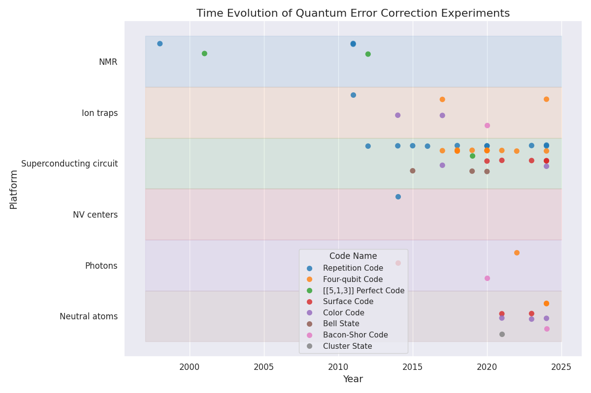

# Awesome Quantum Computing Experiments

A comprehensive collection of notable quantum computing experiments, focusing on implementations of quantum error correction codes and other key metrics.

## Latest Highlights



## Visualizations

### Quantum Error Correction Timeline
[View QEC database →]({{ site.baseurl }}/experiments#quantum-error-correction-qec)
{: .plot}

### [[n, k, d]] Distribution
[View QEC database →]({{ site.baseurl }}/experiments#quantum-error-correction-qec)
{: .plot}

### Entangled State Error Progress
[View Entangled State database →]({{ site.baseurl }}/experiments#entangled-state-error)

### Qubit Count Evolution
[View Qubit Count database →]({{ site.baseurl }}/experiments#physical-qubit-count)

## About

This database tracks:
- Quantum Error Correction (QEC) implementations
- Magic State Distillation (MSD) experiments
- Entangled State Error measurements
- Physical Qubit Count evolution

[View on GitHub <i class="fa-brands fa-github"></i>](https://github.com/francois-marie/awesome-quantum-computing-experiments){: .button} 
